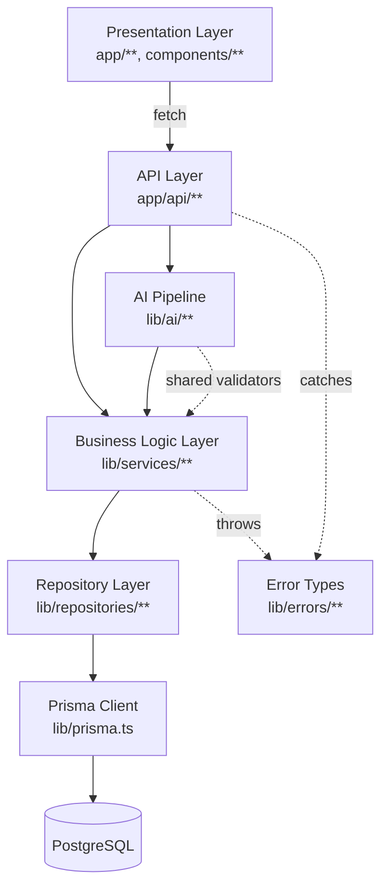
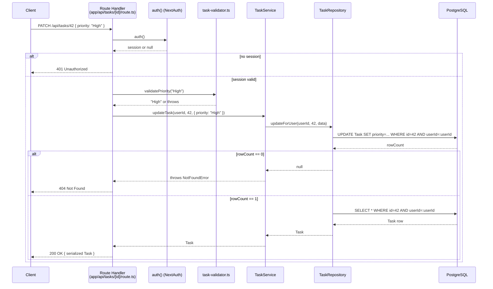
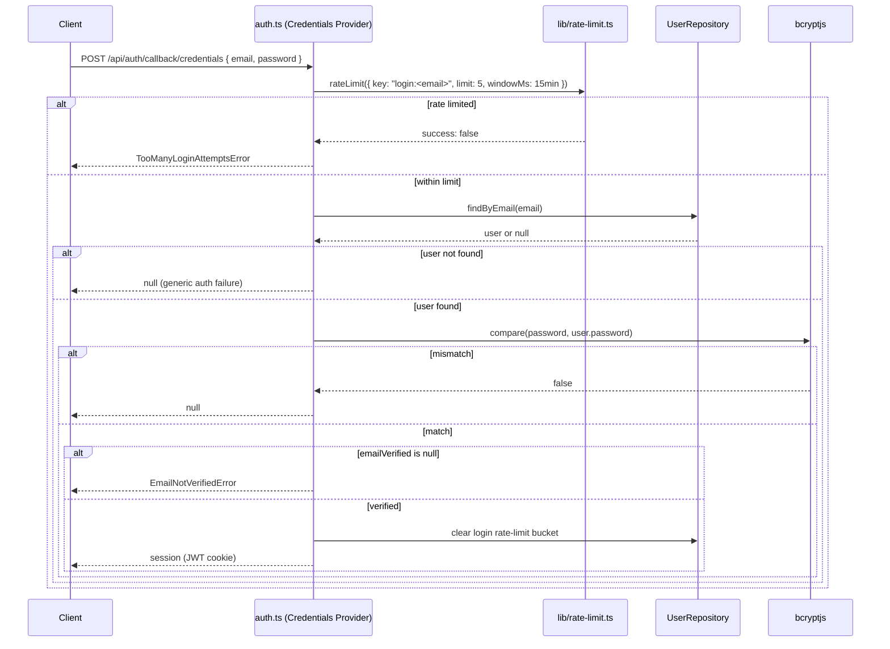
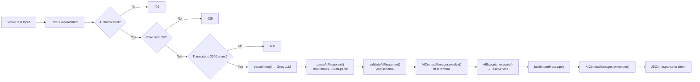

# 03 — System Architecture

## 1. Architectural Style

TaskFlow is a **monolithic, layered Next.js application**. There is no separate backend service, no microservices split, and no API gateway — the Next.js App Router serves server-rendered pages, client components, and JSON API route handlers from a single deployable process. Within that monolith, the codebase enforces a strict internal layering:

```
Presentation (React Server/Client Components)
        ↓
API Layer (Next.js Route Handlers, app/api/**)
        ↓
Business Logic Layer (lib/services/**, lib/ai/**)
        ↓
Repository Layer (lib/repositories/**)
        ↓
Database Layer (Prisma Client → PostgreSQL)
```

This layering is not aspirational — it is consistently observed across every route handler and service inspected during this audit. Each layer is described below.

## 2. Layer Breakdown

### 2.1 Presentation Layer

React 19 components under `app/**` (pages, layouts) and `components/**` (shared UI). This layer is further split between:

- **Server Components** — e.g., `app/dashboard/page.tsx`, `app/dashboard/layout.tsx` — resolve the session server-side (`await auth()`) and redirect unauthenticated visitors before any client JavaScript runs, avoiding a flash of protected content.
- **Client Components** (`"use client"`) — e.g., `app/dashboard/Dashboard.tsx`, `components/VoiceControl.tsx`, `components/AITextControl.tsx` — own interactive state (task list, filters, voice recognition, form state) and call the API layer via `fetch`.

**Why this split:** Next.js App Router defaults to Server Components; the codebase only opts into client components where interactivity genuinely requires it (forms, voice input, session-aware navigation). `app/dashboard/layout.tsx` contains an explicit comment explaining that `SessionProvider` (a client component) is scoped only to the routes that actually call `useSession()`, specifically to avoid mounting unnecessary client-side JavaScript on pages that don't need it — a deliberate performance decision, not a default.

### 2.2 API Layer

Next.js Route Handlers under `app/api/**`. Every handler follows the same shape:

1. Authenticate (`await auth()` from `auth.ts`) where the route requires a session.
2. Validate/parse the request body.
3. Apply a rate limit where the route is sensitive (`lib/rate-limit.ts`).
4. Delegate to a service (`lib/services/**` or `lib/ai/**`).
5. Catch `AppError` subclasses and map them to the correct HTTP status; catch anything else, log it, and return a generic `500`.

**Why route handlers own auth/validation instead of middleware:** there is no `middleware.ts`/`proxy.ts` in this application. `next.config.ts` contains an explicit comment explaining the CSP configuration was deliberately built *without* a per-request nonce specifically because adding middleware just to thread one through would force several currently-static pages into dynamic rendering — a rendering-strategy tradeoff judged out of scope for what was, at the time, a security-only pass. The consequence is that every route re-implements its own auth/session check rather than relying on a shared edge gate — a real, verifiable duplication (visible identically across all 8 auth-adjacent routes and both task routes), traded for keeping static pages static.

### 2.3 Business Logic Layer

`lib/services/**` (`AuthService`, `TaskService`) and `lib/ai/**` (the AI pipeline, detailed in [07-AI-Module.md](./07-AI-Module.md)).

Services own business rules — password hashing, token generation and expiry, matching/searching semantics — but do not touch Prisma directly for anything beyond the transactions explicitly delegated to route handlers. This boundary is documented in the source itself: `AuthService`'s class-level comment states it "never touches Prisma directly, reads Request objects, or returns HTTP responses — that stays in the route handlers," and several of its methods (`prepareRegistration`, `resetPassword`, `verifyEmail`, `prepareVerificationResend`) have comments explaining *why* they stop short of persisting: the actual multi-table write happens in the calling route via `prisma.$transaction`, because the service is deliberately forbidden from importing Prisma directly.

**Why split "prepare" from "persist":** this pattern (`prepareRegistration` → route builds a `prisma.$transaction` → `completeRegistration` sends the email) exists so that user creation and verification-token creation happen atomically in one transaction, while the service itself stays free of direct database coupling — a clean-architecture-style dependency rule (business logic doesn't depend on the persistence mechanism) enforced by convention and comments rather than a compiler-checked boundary.

### 2.4 Repository Layer

`lib/repositories/**` — thin, typed wrappers around Prisma Client, one per model (`UserRepository`, `TaskRepository`, `VerificationTokenRepository`, `PasswordResetTokenRepository`).

**Why this layer exists (not just "call Prisma from the service"):** ownership enforcement lives here, not in the service or route. `TaskRepository.updateForUser`/`deleteForUser`/`findByIdForUser` all scope their Prisma query to `{ id, userId }` in the `where` clause itself — so a task belonging to another user is invisible to the query, not filtered out afterward. This means ownership can't be accidentally forgotten by a future service method, because it's structurally impossible to fetch another user's task through this repository at all.

A second, subtler reason surfaces in `UserRepository`, `VerificationTokenRepository`, and `PasswordResetTokenRepository`: several methods (`updatePassword`, `markEmailVerified`, token `create`/`deleteMany`) are deliberately **not** `async` functions — they return the raw `Prisma.PrismaPromise` instead of one wrapped by `async`/`await`, with an inline comment explaining this is required so the caller can pass them directly into a `prisma.$transaction([...])` batch array, which needs the original query promise rather than an awaited result.

### 2.5 Database Layer

PostgreSQL, accessed exclusively through a single shared Prisma Client instance (`lib/prisma.ts`), which memoizes the client on `globalThis` outside of production to avoid exhausting connections from Next.js's module-reloading in development. See [05-Database-Design.md](./05-Database-Design.md) for the full schema.

## 3. Why This Architecture Was Chosen

The layering decision that most shapes the rest of the system is that the **AI assistant is a second entry point into the same business logic, not a parallel implementation.** `lib/ai/executor.ts` calls `taskService` — the identical service `app/api/tasks/route.ts` calls — and `lib/ai/mappers/task.mapper.ts` calls the identical validators in `lib/task/task-validator.ts` that the REST routes use (`validateTitleForUpdate`, `parseStrictDueDate` via `normalizeLabel`, etc.). This is a direct, load-bearing design choice: if the AI pipeline had its own copy of task-creation logic, the two paths could silently drift (e.g., the REST API enforcing a title length limit the AI path forgot to), producing data that's valid through one door and invalid through the other. Routing both through one service closes that gap by construction.

## 4. Dependency Flow



Dependencies flow strictly downward: presentation depends on the API layer, the API layer depends on business logic, business logic depends on repositories, repositories depend on Prisma. No layer reaches back upward, and no layer skips a level (route handlers do not import repositories directly — confirmed by inspecting every `app/api/**/route.ts` file, all of which import from `lib/services` or `lib/ai`, never from `lib/repositories`, with the sole exception of the explicit `prisma.$transaction` blocks route handlers build themselves for multi-table atomic writes).

## 5. Request Lifecycle

A representative authenticated, non-AI request (`PATCH /api/tasks/:id`):



The `rowCount == 0` branch is the concrete mechanism behind ownership isolation (FR-18): a request against a task ID that exists but belongs to someone else produces the identical `404` as a request against an ID that doesn't exist at all — the two cases are indistinguishable to the caller, which is deliberate (no existence leakage).

## 6. Authentication Flow



Session strategy is `"jwt"` (`auth.ts`, `session: { strategy: "jwt" }`) rather than database-backed sessions — no `Session` table exists in `prisma/schema.prisma`. This means session validity is entirely determined by JWT signature/expiry (`AUTH_SECRET`), not by a revocable server-side record; there is no mechanism in the codebase to forcibly invalidate a single already-issued session (e.g., on password change) short of it expiring naturally or the client discarding its cookie.

## 7. AI Request Flow

See [07-AI-Module.md](./07-AI-Module.md) for the complete breakdown; summarized here for architectural context:



The AI pipeline sits **beside** the business logic layer, not inside the API layer or as a replacement for it — `AIExecutor` calls `TaskService` exactly as `app/api/tasks/route.ts` does, which is the architectural decision explained in Section 3.

## 8. Advantages of This Architecture

- **Single deployment unit.** No service-to-service network calls, no distributed-systems failure modes (partial outages, service discovery, cross-service auth) to reason about.
- **One implementation of task rules.** The REST and AI paths cannot silently diverge in validation behavior, because they call the same code.
- **Ownership enforcement is structural, not procedural.** A future contributor adding a new task-repository method would have to actively choose to omit the `userId` scoping — the existing pattern makes the safe choice the path of least resistance.
- **Testable in isolation.** Because services don't import Prisma directly (with the deliberate transaction exception), and repositories are thin, the business-logic layer is straightforward to unit test without a real database for most cases — reflected in the test suite's structure (see [09-Testing.md](./09-Testing.md)).

## 9. Tradeoffs and Costs

- **No middleware means duplicated auth checks.** Every route re-implements the same "get session, validate userId is a positive integer" block. This is a real, measurable duplication (identical code repeated across ~10 files), accepted in exchange for keeping unauthenticated pages statically rendered.
- **JWT sessions can't be server-side revoked.** Changing a password does not invalidate an already-issued session token elsewhere; it will remain valid until it naturally expires.
- **The AI pipeline's conversational memory doesn't scale horizontally.** `AIContextStore` is an in-process `Map` — correct on a single long-running instance, but not shared across multiple instances or serverless invocations. This is the direct cost of choosing a zero-infrastructure (no Redis, no session-store dependency) approach for a feature (multi-turn context) that conventionally wants shared state.
- **Rate limiting costs a DB round-trip per protected request.** Chosen over an in-memory or Redis-backed limiter specifically because it requires no additional infrastructure and *does* work correctly across multiple instances (unlike the AI context store) — the opposite tradeoff, made deliberately differently for a feature where cross-instance correctness mattered more than raw latency.

---
*Related documents: [04-System-Design.md](./04-System-Design.md), [07-AI-Module.md](./07-AI-Module.md), [05-Database-Design.md](./05-Database-Design.md), `docs/diagrams/`*
