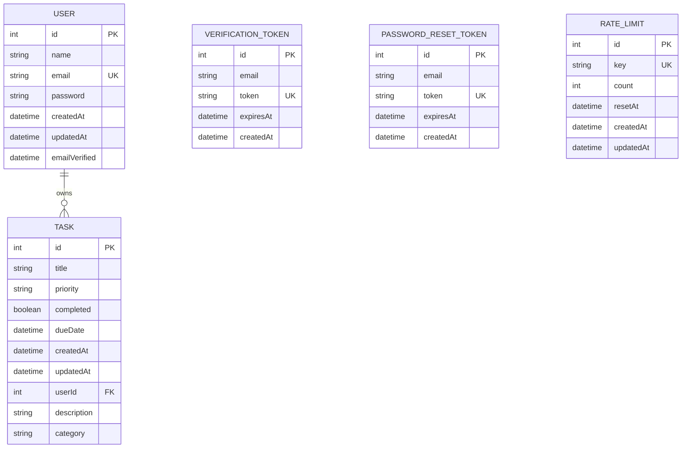

# 05 — Database Design

## 1. Overview

TaskFlow uses PostgreSQL as its sole datastore, accessed exclusively through Prisma ORM (`@prisma/client` 6.19.3). The schema is defined in `prisma/schema.prisma` and consists of five models. This document reflects that file exactly as it exists in the repository today (reproduced in full below for traceability).

```prisma
generator client {
  provider = "prisma-client-js"
}

datasource db {
  provider = "postgresql"
  url      = env("DATABASE_URL")
}

model User {
  id            Int       @id @default(autoincrement())
  name          String?
  email         String    @unique
  password      String
  createdAt     DateTime  @default(now())
  updatedAt     DateTime  @updatedAt
  emailVerified DateTime?
  tasks         Task[]
}

model Task {
  id          Int       @id @default(autoincrement())
  title       String
  priority    String    @default("Medium")
  completed   Boolean   @default(false)
  dueDate     DateTime?
  createdAt   DateTime  @default(now())
  updatedAt   DateTime  @updatedAt
  userId      Int
  description String?
  category    String    @default("Other")
  user        User      @relation(fields: [userId], references: [id], onDelete: Cascade)
}

model VerificationToken {
  id        Int      @id @default(autoincrement())
  email     String
  token     String   @unique
  expiresAt DateTime
  createdAt DateTime @default(now())

  @@index([email])
}

model PasswordResetToken {
  id        Int      @id @default(autoincrement())
  email     String
  token     String   @unique
  expiresAt DateTime
  createdAt DateTime @default(now())

  @@index([email])
}

model RateLimit {
  id        Int      @id @default(autoincrement())
  key       String   @unique
  count     Int      @default(1)
  resetAt   DateTime
  createdAt DateTime @default(now())
  updatedAt DateTime @updatedAt

  @@index([resetAt])
}
```

## 2. Entity-Relationship Diagram



`VERIFICATION_TOKEN`, `PASSWORD_RESET_TOKEN`, and `RATE_LIMIT` are intentionally **not** foreign-keyed to `USER` — they're keyed by `email`/`key` strings instead. This is discussed in Section 5.

## 3. Table Reference

### 3.1 `User`

| Column | Type | Constraints | Notes |
|---|---|---|---|
| `id` | `Int` | PK, autoincrement | |
| `name` | `String?` | nullable | Display name; validated 2–100 chars at the application layer (no DB-level length constraint) |
| `email` | `String` | unique, not null | Used as the login identifier; case-normalized (lowercased) by the application before every write/read, not by the database |
| `password` | `String` | not null | bcrypt hash (cost 12), never plaintext |
| `createdAt` | `DateTime` | default `now()` | |
| `updatedAt` | `DateTime` | `@updatedAt` (auto-managed) | |
| `emailVerified` | `DateTime?` | nullable | `null` = unverified; a timestamp = verified at that time. Doubles as both a boolean flag and an audit timestamp. |

### 3.2 `Task`

| Column | Type | Constraints | Notes |
|---|---|---|---|
| `id` | `Int` | PK, autoincrement | |
| `title` | `String` | not null | App-layer limit: 200 chars |
| `priority` | `String` | default `"Medium"` | App-layer allow-list: `Low`/`Medium`/`High`. **Not a Postgres enum** — stored as free text, constrained only by application code (`lib/task/task-validator.ts`) |
| `completed` | `Boolean` | default `false` | |
| `dueDate` | `DateTime?` | nullable | Stored as a full timestamp; application always writes/reads UTC midnight for the date, serialized to `YYYY-MM-DD` for the client (`task-serializer.ts`) |
| `createdAt` | `DateTime` | default `now()` | |
| `updatedAt` | `DateTime` | `@updatedAt` | |
| `userId` | `Int` | FK → `User.id` | |
| `description` | `String?` | nullable | App-layer limit: 2000 chars |
| `category` | `String` | default `"Other"` | App-layer allow-list: `Work`/`Personal`/`Study`/`Other`. Same free-text-with-app-constraint pattern as `priority`. |

**Relationship:** `Task.user` → `User`, `onDelete: Cascade` — deleting a `User` row deletes all of that user's `Task` rows at the database level. This is a deliberate, load-bearing decision: `DELETE /api/delete-account`'s own transaction manually deletes verification/reset tokens by email but relies on this cascade (not application code) for tasks — the route's in-code comment says exactly that: *"Tasks should automatically be deleted if your Prisma Task → User relation uses: onDelete: Cascade."*

### 3.3 `VerificationToken` / `PasswordResetToken`

Structurally identical, kept as two separate tables rather than one polymorphic table:

| Column | Type | Constraints | Notes |
|---|---|---|---|
| `id` | `Int` | PK, autoincrement | |
| `email` | `String` | indexed (`@@index([email])`) | Not unique — an email can have at most one *active* token in practice (application always deletes-then-recreates), but nothing at the schema level prevents duplicates |
| `token` | `String` | unique | Stores the **SHA-256 hash** of the token, never the raw value (`lib/auth/token.ts`) |
| `expiresAt` | `DateTime` | not null | 1-hour lifetime, enforced at the application layer |
| `createdAt` | `DateTime` | default `now()` | |

**Why two tables instead of one shared "Token" table with a `type` discriminator:** not stated explicitly in the code, but the effect is that verification and reset tokens can never collide or be confused for one another even by a bug — a query against `PasswordResetToken` structurally cannot return a verification token, whereas a shared table with a `type` filter could, if that filter were ever omitted.

### 3.4 `RateLimit`

| Column | Type | Constraints | Notes |
|---|---|---|---|
| `id` | `Int` | PK, autoincrement | |
| `key` | `String` | unique | Caller-defined string, e.g. `login:user@example.com`, `ai-intent:42` |
| `count` | `Int` | default `1` | Requests seen in the current window |
| `resetAt` | `DateTime`, indexed | | When the current window expires |
| `createdAt` / `updatedAt` | `DateTime` | | |

Implements a fixed-window counter, not a sliding-window or token-bucket algorithm — see [04-System-Design.md § "Cross-Cutting Concerns"](./03-System-Architecture.md) and [11-Security.md](./11-Security.md) for the rate-limiting logic itself.

## 4. Indexes

| Table | Index | Purpose |
|---|---|---|
| `User` | unique on `email` | Login lookup; also the uniqueness constraint preventing duplicate accounts |
| `VerificationToken` | unique on `token`; `@@index([email])` | Token lookup by hash (unique); bulk delete-by-email when reissuing |
| `PasswordResetToken` | unique on `token`; `@@index([email])` | Same pattern as above |
| `RateLimit` | unique on `key`; `@@index([resetAt])` | Bucket lookup by key (unique); the `resetAt` index supports any future cleanup query filtering on expiry (no such query currently exists in the codebase — see Section 7) |
| `Task` | none beyond the implicit PK | **No explicit `@@index([userId])`.** Every task query filters on `userId} (`findByUserId`, `findByIdForUser`, `updateForUser`, `searchByUserId` all include it in their `where` clause), making it the single most performance-critical filter column in the schema, yet the schema does not declare an index on it. |

**Assumption/Caveat:** Recent Prisma versions typically create an index on a relation's foreign-key scalar automatically as part of the migration Prisma generates for a `@relation`. Because the migration history is now committed in this repository, it is possible to confirm from the repository whether `Task.userId` is indexed by reviewing `prisma/migrations/20260731112025_init/migration.sql`. This is flagged, not assumed either way — see [10-Deployment.md](./10-Deployment.md) for the operational implication.

## 5. Relationships & Design Rationale

- **`User` 1—N `Task`**, the only foreign-key relationship in the schema. Every other model (`VerificationToken`, `PasswordResetToken`, `RateLimit`) is deliberately **not** foreign-keyed to `User`:
  - Token tables are keyed by `email` (a string) rather than `userId`, which lets `forgotPassword`/`prepareVerificationResend` operate before confirming a user exists in some call paths, and keeps the token lifecycle decoupled from whether the referenced account still exists at all.
  - `RateLimit` is keyed by an arbitrary caller-defined string (`login:<email>`, `register:<ip>`, `ai-intent:<userId>`) precisely because rate limiting needs to key on things that aren't always a user ID — an IP address for unauthenticated endpoints like registration, for instance. A foreign key to `User` would be actively wrong for those cases.

## 6. Normalization

The schema is in **Third Normal Form (3NF)** for the data it models: every non-key attribute in each table depends on the whole primary key and nothing but the key (no transitive dependencies, no repeating groups). The one point worth calling out explicitly:

- `priority` and `category` on `Task` are stored as plain `String` rather than normalized into separate `Priority`/`Category` lookup tables. This is a deliberate simplicity tradeoff appropriate for a small, fixed, applica­tion-enforced enumeration (four categories, three priorities) — normalizing them into their own tables would add join overhead and migration complexity for values that essentially never change and are already validated centrally in `lib/task/task-validator.ts`. The cost of this choice is that the *database* cannot itself reject an invalid category/priority value — that responsibility rests entirely on the application layer (see [11-Security.md](./11-Security.md) for the implication of relying on app-layer-only enum enforcement).

## 7. Migration Strategy

**This is the single most significant finding in this documentation set regarding the database layer.**

`prisma.config.ts` declares:

```ts
migrations: {
  path: "prisma/migrations",
},
```

This repository contains committed migration history in `prisma/migrations/20260731112025_init/migration.sql`, which matches `prisma/schema.prisma`. The prior deployment gap described here has been resolved by that committed baseline migration.

**Implication:** there is now a repeatable, auditable path from an empty PostgreSQL database to TaskFlow's schema, and production deployment can use `npx prisma migrate deploy`.

**Recommended migration strategy going forward** (see [10-Deployment.md](./10-Deployment.md) and [14-Future-Enhancements.md](./14-Future-Enhancements.md)):
1. Run `npx prisma migrate dev --name init` against a real, disposable PostgreSQL instance to generate and commit a baseline migration reflecting the current schema exactly.
2. From that point forward, every schema change goes through `prisma migrate dev` locally and `prisma migrate deploy` in CI/production — never `db push` against a database that matters.
3. Verify `prisma migrate deploy` succeeds against a genuinely empty database as part of the release process, closing the gap identified here.

## 8. Database Lifecycle

| Stage | Current Mechanism | Notes |
|---|---|---|
| Schema definition | `prisma/schema.prisma`, hand-maintained | |
| Client generation | `@prisma/client`'s own postinstall hook (runs `prisma generate` automatically when `prisma` is also a dependency) | No explicit `postinstall` script in `package.json` was needed; verified the production build succeeds without one |
| Schema provisioning | **Undocumented / unverifiable** (see Section 7) | Release blocker |
| Connection management | `lib/prisma.ts`, one memoized client, `globalThis`-cached outside production | Standard Next.js/Prisma pattern avoiding connection exhaustion from hot-reload in dev |
| Cleanup / retention | **None for `RateLimit`**, beyond the one specific case in `auth.ts` where a successful login deletes its own key | Expired `RateLimit` rows are correctly *ignored* by `lib/rate-limit.ts`'s logic but never deleted — unbounded table growth over the life of a deployment. Not a correctness bug; an operational cost. See [11-Security.md](./11-Security.md) and [14-Future-Enhancements.md](./14-Future-Enhancements.md). |
| Cascading deletes | `Task` cascades from `User` at the database level | The only cross-table cleanup the database performs automatically; every other cleanup (tokens on account deletion, tokens on password reset) is done explicitly by application code inside a transaction |

---
*Related documents: [03-System-Architecture.md](./03-System-Architecture.md), [10-Deployment.md](./10-Deployment.md), [11-Security.md](./11-Security.md), `docs/diagrams/er-diagram.md`*
