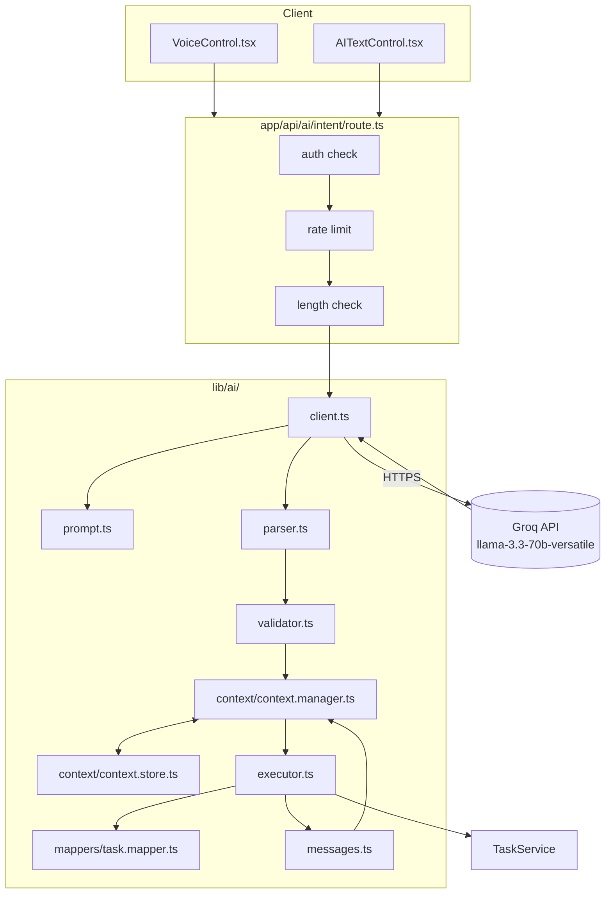

# 07 — AI Module

## 1. Purpose

The AI module lets an authenticated user manage tasks through natural-language voice or text commands instead of (or alongside) the manual form-based UI. It is not a chatbot with general conversational ability — it is a narrow, constrained natural-language interface to exactly ten task operations, backed by an LLM used purely as an intent-classification and slot-filling engine.

## 2. Architecture



## 3. Groq Integration

The AI provider is [Groq](https://groq.com), accessed via the standard `openai` npm SDK (v7) pointed at Groq's OpenAI-compatible endpoint:

```ts
// lib/ai/client.ts
new OpenAI({
  apiKey: config.groqApiKey,
  baseURL: "https://api.groq.com/openai/v1",
  timeout: config.requestTimeoutMs,
});
```

**Why Groq via the OpenAI SDK, rather than a Groq-specific SDK:** Groq's API is OpenAI-compatible by design, so this lets the codebase use a mature, widely-used client library instead of a smaller provider-specific package, while keeping the integration point (`getClient()`, `baseURL`) narrow enough that switching providers would mean changing one constant plus the API key, not rewriting the pipeline.

**Client lifecycle:** `getClient()` lazily constructs and memoizes a single `OpenAI` instance at module scope, resolving `getAIConfig()` first (see [04-System-Design.md § 9](./04-System-Design.md#9-configuration-module)) — a source comment explains this ordering is required because the OpenAI SDK itself throws an uncaught error if constructed with no resolvable API key, so configuration must be validated *before* construction, not just before use, or a missing key would crash the request instead of failing cleanly through the application's own `AppError` handling.

## 4. LLM Selection

**Model:** `llama-3.3-70b-versatile`, read from `process.env.AI_MODEL` with that value as the fallback default (`lib/ai/client.ts`).

**Assumption:** the choice of this specific model is not explained anywhere in the codebase (no comment, no ADR). Llama 3.3 70B is a capable general-purpose open model available on Groq's low-latency inference infrastructure — a reasonable fit for a low-latency, structured-output task like intent classification, but the *reasoning* behind this specific choice (vs. a smaller/cheaper or larger/more-capable alternative) is not documented in the repository and should not be presented as a stated design decision.

**Inference parameters:** `temperature: 0` (deterministic-as-possible output, appropriate for a classification task with one correct structured answer) and `response_format: { type: "json_object" }` (Groq/OpenAI JSON mode, constraining the model to emit syntactically valid JSON).

## 5. Prompt Engineering

The system prompt (`lib/ai/prompt.ts`, `getIntentSystemPrompt()`) is generated per-request, not a static string, because it embeds the current date. Its structure:

1. **Role framing:** "You are TaskFlow AI, an intelligent task management assistant."
2. **Strict output contract:** "Return ONLY a valid JSON object... Never use code fences... Never explain your reasoning." — defensive prompting against the two most common LLM failure modes for structured output (prose wrapping, Markdown fencing), both of which are *also* defended against downstream in `parser.ts` (see Section 7) — a deliberate belt-and-suspenders approach rather than trusting prompt compliance alone.
3. **The ten supported intents**, listed explicitly by name (`create_task`, `update_task`, `delete_task`, `complete_task`, `uncomplete_task`, `list_tasks`, `search_tasks`, `change_priority`, `change_category`, `summarize_today`).
4. **A fixed response schema** the model must populate: `{ intent, task, changes, query }`.
5. **Per-intent field-population rules** (e.g., "update_task: put ONLY modified fields inside 'changes'").
6. **A closed priority vocabulary** (`low`/`medium`/`high`), with an explicit negative example list (`Low`, `Medium`, `High`, `Urgent` — capitalized/synonym forms the model must *not* use), addressing a specific, named failure mode: the model defaulting to Title Case or inventing an "Urgent" tier that doesn't exist in the schema.
7. **Relative-date resolution**, computed server-side and injected as concrete examples: the prompt calculates "today," "tomorrow," and "next Monday" as real `YYYY-MM-DD` values (via `getCurrentDate()`, `addDays()`, `getNextMonday()`, all in `prompt.ts`) and shows the model the exact expected mapping (e.g., `"today" -> "2026-08-01"`), rather than asking the model to compute relative dates itself — offloading date arithmetic (a known LLM weak point) to deterministic server code.
8. **Three worked examples** covering create, complete (with query-based task resolution), and search — few-shot examples reinforcing the schema and field-placement rules from Section 5/6 above.

**Timezone note:** `getCurrentDate()` resolves "today" using `Intl.DateTimeFormat` with `timeZone: "Asia/Karachi"` — a fixed, hardcoded timezone rather than one derived from the user's request or profile. *Assumption:* no per-user timezone field exists anywhere in the schema or codebase, so this is presented as a known, fixed-timezone limitation rather than a configurable feature — see [14-Future-Enhancements.md](./14-Future-Enhancements.md).

## 6. Intent Detection

The ten intents are defined as a TypeScript enum (`lib/types/ai.ts`, `AIIntent`) shared between the prompt, the Zod validator, and the executor's `switch` statement — a single source of truth for "what intents exist" that the compiler enforces is exhaustively handled in `AIExecutor.execute()` (a `default` branch throws `ValidationError` for any unrecognized intent, which would only occur if the model returned a string outside the enum, since the Zod schema below already rejects that case before execution).

## 7. Parser

`lib/ai/parser.ts`, `parseAIResponse()`:

1. Rejects an empty/whitespace-only response outright.
2. Strips accidental Markdown code fences (```` ```json ```` / ```` ``` ````) the model might add despite the prompt instructing otherwise — defensive handling of a documented real-world LLM quirk, not a hypothetical.
3. `JSON.parse`s the cleaned string; on failure, logs the parse error **and** a truncated (1,000-char max) copy of the raw response to the console — the only place in the pipeline both the parse error and the offending raw text are still available together, per the function's own comment, since the `AIResponseError` it throws afterward deliberately carries neither (to avoid leaking raw model output into a client-facing error).

## 8. Validator

`lib/ai/validator.ts`, `validateAIResponse()` — a Zod schema (`AIResponseSchema`):

```
intent: nativeEnum(AIIntent)          // required
task:    { title (required), description?, priority? (low|medium|high), category?, dueDate?, completed? } | null
changes: same shape as task, but every field optional (Task.partial())
query:   { title?, category?, completed?, priority? } | null
```

Any schema violation collapses to a single generic `AIResponseError` ("The AI returned a response that did not match the expected format") — deliberately not leaking Zod's detailed validation error tree to the client, since that tree could describe the model's internal output in ways not meant for end users.

## 9. Executor

`lib/ai/executor.ts`, `AIExecutor.execute()` — a pure dispatch `switch` over the ten intents, each delegating to `TaskService`:

| Intent | Executor Method | TaskService Call |
|---|---|---|
| `create_task` | `createTask` | `createTask` (via `toTaskCreateInput` mapper) |
| `update_task` | `updateTask` | `updateTask` (via `toTaskUpdateInput` mapper) |
| `delete_task` | `deleteTask` | *(resolves only — see below)* |
| `complete_task` | `completeTask` | `completeTask` |
| `uncomplete_task` | `uncompleteTask` | `uncompleteTask` |
| `list_tasks` | `listTasks` | `getUserTasks` |
| `search_tasks` | `searchTasks` | `searchTasks` |
| `change_priority` | `changePriority` | `updateTask` (priority only) |
| `change_category` | `changeCategory` | `updateTask` (category only) |
| `summarize_today` | `summarizeToday` | `getTasksDueToday` |

**Task resolution for update/delete/complete/etc.:** `findTask()` calls `TaskService.findMatchingTask`, which searches the user's tasks by whatever criteria the AI supplied (`query` or `task`, e.g. partial case-insensitive title match) and requires **exactly one** match — zero matches throws `NotFoundError`, more than one throws `ValidationError` ("Task request is ambiguous"). This is a deliberate safety choice: the executor never guesses which of several similarly-named tasks the user meant.

**Delete is intentionally non-destructive at this layer.** `deleteTask()` in the executor only resolves the target task and returns it — it does not call `taskService.deleteTask`. The actual deletion happens through the ordinary `DELETE /api/tasks/:id` REST endpoint, triggered client-side only after the user confirms via the dashboard's existing delete-confirmation modal (`Dashboard.tsx`'s `runAICommand`, which special-cases `AIIntent.DELETE_TASK` to open the confirmation UI instead of treating the AI response as already-applied). This means a misheard or misinterpreted "delete" voice command cannot destroy data without an explicit, separate human confirmation step.

## 10. Context Manager & Conversation Memory

`lib/ai/context/context.manager.ts` (`AIContextManager`) and `context.store.ts` (`AIContextStore`):

- **Resolution (`resolve()`):** if the current AI response has no `task` but a remembered `lastTask` exists, the remembered task's fields are substituted in — this is what makes "make it high priority" work after "buy groceries tomorrow" without the user repeating the task name. Same substitution pattern for `lastQuery`.
- **Memory (`remember()`):** after a successful execution, if the result was an array, the *query* that produced it is remembered (for "show more like that"); if it was a single task, that task (mapped to a lightweight `AIContextTask` shape via `toAIContextTask`) is remembered.
- **Storage:** `AIContextStore` holds an in-process `Map<number, AIConversationContext>` keyed by `userId`. **This is not a Prisma model** — an explicit comment on `AIContextTask` states this directly.
- **Expiry:** 30 minutes of inactivity (`AI_CONTEXT_TTL_MS`), evaluated lazily — there is no background timer; every `get`/`has`/`getOrCreate` call routes through `getIfActive()`, which evicts a context on read if it's stale, and every `set`/`update` call additionally sweeps the entire map for other stale entries as a side effect (`sweepExpired()`). This means memory is only ever reclaimed as a byproduct of real request traffic, never proactively — a deliberate zero-infrastructure design (no cron, no timer) at the cost of a context technically remaining resident in memory indefinitely if that specific user (or any user, for the sweep) never sends another request after leaving one active.

**Limitations** (see also [03-System-Architecture.md § 9](./03-System-Architecture.md#9-tradeoffs-and-costs)):
- Conversation memory does not persist across a server restart.
- Conversation memory is not shared across multiple server instances — on a horizontally-scaled or serverless deployment, a follow-up command's context resolution depends on hitting the same process that handled the prior turn, which is not guaranteed. This is a real correctness/UX risk specific to that deployment topology, not a crash risk (a cache miss just means "it"/"that" fails to resolve, falling through to `ValidationError: "Task identification is required"` rather than silently acting on the wrong task).

## 11. Error Handling

Every stage of the pipeline raises a specific, typed error rather than a generic exception:

| Stage | Error Type | HTTP Mapping |
|---|---|---|
| Empty/unparsable AI response | `AIResponseError` | Caught by route's `AppError` branch |
| Schema-invalid AI response | `AIResponseError` | Same |
| Ambiguous/missing task reference | `ValidationError` | Same |
| Task not found | `NotFoundError` | Same |
| Missing/invalid AI config | `AppError` (500) | Same |
| Anything uncaught | generic | Logged via `logger.error("AI intent request failed", error)`, `500` |

## 12. Retry Strategy

**There is no retry logic anywhere in the AI pipeline.** A failed Groq request (timeout, network error, non-2xx response) is not retried — it surfaces immediately as an error to the client. This is a factual observation, not a criticism disguised as one: for a synchronous, user-initiated voice/text command, an automatic retry would add latency the user is actively waiting through, and the OpenAI SDK's own default retry behavior is not overridden or disabled anywhere in `lib/ai/client.ts`, so whatever the SDK's built-in default is applies as-is. See [14-Future-Enhancements.md](./14-Future-Enhancements.md) for a discussion of whether application-level retry would be worth adding.

## 13. Timeout Strategy

`AI_REQUEST_TIMEOUT_MS` (default 15,000 ms, configurable via env var, validated in `lib/ai/config.ts` — must be a positive integer or the app throws a config error) is passed directly into the `OpenAI` client's `timeout` option. On timeout, the SDK throws `APIConnectionTimeoutError`, which `lib/ai/client.ts` catches specifically and re-throws as an `AppError` with a `504`-appropriate message: *"The AI assistant is taking too long to respond. Please try again."* — every other error type from the SDK call passes through unmodified to the route's generic catch handler.

## 14. Safety

- **Untrusted output is never executed directly.** The LLM's response is parsed, schema-validated, and only then handed to the executor — at no point does raw model output reach a database write without passing through both `parseAIResponse` and `validateAIResponse`.
- **The model cannot act outside a fixed operation set.** There is no "run arbitrary code" or "call arbitrary tool" affordance — the model's only output surface is the ten-intent JSON schema, and the executor's `switch` only recognizes exactly those ten values.
- **Deletion requires human confirmation** (Section 9) — the single most consequential operation the assistant could trigger is deliberately not fully automated.
- **Every AI request is authenticated and scoped to `userId`** — the model has no way to act on another user's data, because `AIExecutor.execute()` and every `TaskService` call it makes take `userId` from the authenticated session, never from anything the model returns.
- **Rate limiting and transcript-length caps** (20/min/user, 2,000 chars) bound both cost exposure to the Groq API and the blast radius of a single abusive session.

## 15. Advantages

- Reuses the exact same task-validation and persistence logic as the manual REST API (Section 9; [03-System-Architecture.md § 3](./03-System-Architecture.md#3-why-this-architecture-was-chosen)) — no risk of the AI path producing data the REST path would consider invalid, or vice versa.
- Defense-in-depth against the two most common structured-output LLM failures (fenced Markdown, malformed/off-schema JSON), handled at both the prompt level and the code level.
- Conversational context makes short, natural follow-up commands work without the user re-stating the task every time.
- Strong test coverage: `lib/ai/integration.test.ts` exercises the pipeline end-to-end, and the AI-related paths are inside the project's most heavily covered code (95.7% line coverage on the scoped test areas — see [09-Testing.md](./09-Testing.md)).

## 16. Limitations

- In-memory conversational context does not survive a restart and is not shared across multiple instances (Section 10).
- No retry on transient upstream failures (Section 12).
- Fixed server-side timezone (`Asia/Karachi`) for relative-date resolution, not user-configurable (Section 5).
- Single hardcoded model provider/endpoint (Groq); switching providers means editing `lib/ai/client.ts` directly, not a configuration toggle.
- No token/cost usage tracking or logging beyond what the rate limiter counts as request occurrences — actual Groq token consumption per request isn't recorded anywhere in the codebase.

## 17. Future Improvements

See [14-Future-Enhancements.md § AI Improvements](./14-Future-Enhancements.md#ai-improvements) for the full roadmap. Summary: move conversational context to a shared store (Redis or the existing PostgreSQL database) to fix the horizontal-scaling gap; add user-configurable timezone; consider a bounded application-level retry for transient Groq failures; add usage/cost telemetry.

---
*Related documents: [03-System-Architecture.md](./03-System-Architecture.md), [04-System-Design.md](./04-System-Design.md), [06-API-Documentation.md](./06-API-Documentation.md), `docs/diagrams/ai-workflow.md`*
