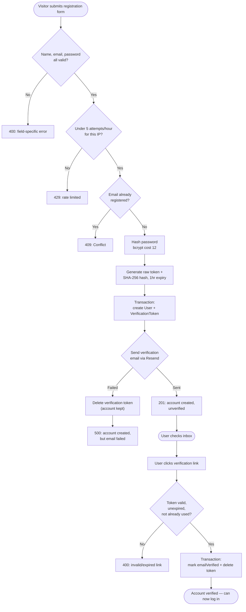

# Activity Diagram — Account Registration & Verification

See [04-System-Design.md § 1](../04-System-Design.md#1-authentication-module) for the underlying implementation.

```mermaid
flowchart TD
    Start([Visitor submits registration form]) --> V1{Name, email, password<br/>all valid?}
    V1 -->|No| E1[400: field-specific error]
    V1 -->|Yes| RL{Under 5 attempts/hour<br/>for this IP?}
    RL -->|No| E2[429: rate limited]
    RL -->|Yes| Dup{Email already<br/>registered?}
    Dup -->|Yes| E3[409: Conflict]
    Dup -->|No| Hash[Hash password<br/>bcrypt cost 12]
    Hash --> Token[Generate raw token +<br/>SHA-256 hash, 1hr expiry]
    Token --> Tx["Transaction:<br/>create User + VerificationToken"]
    Tx --> Email{Send verification<br/>email via Resend}
    Email -->|Failed| Cleanup["Delete verification token<br/>(account kept)"] --> E4["500: account created,<br/>but email failed"]
    Email -->|Sent| Success1[201: account created,<br/>unverified]
    Success1 --> Wait([User checks inbox])
    Wait --> Click[User clicks verification link]
    Click --> V2{Token valid,<br/>unexpired,<br/>not already used?}
    V2 -->|No| E5[400: invalid/expired link]
    V2 -->|Yes| Tx2["Transaction:<br/>mark emailVerified + delete token"]
    Tx2 --> Success2([Account verified — can now log in])
```
