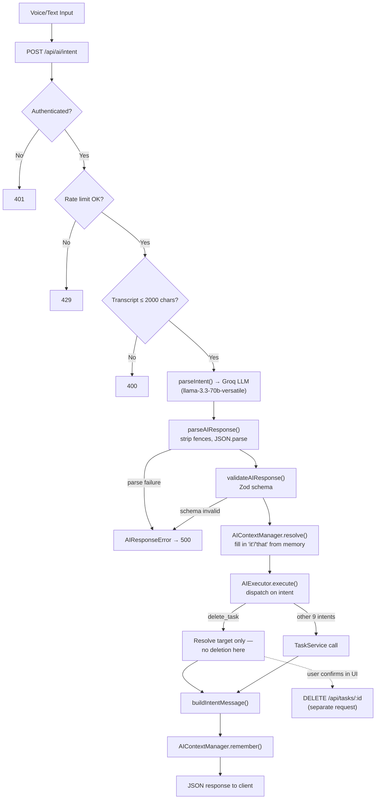
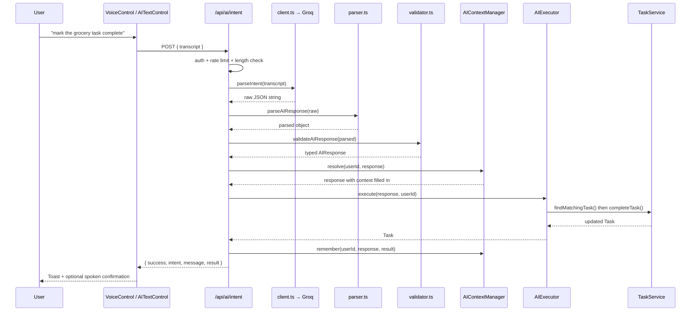

# AI Assistant Workflow

See [07-AI-Module.md](../07-AI-Module.md) for full explanation.

```mermaid
flowchart TD
    A[Voice/Text Input] --> B["POST /api/ai/intent"]
    B --> C{Authenticated?}
    C -->|No| Z1[401]
    C -->|Yes| D{Rate limit OK?}
    D -->|No| Z2[429]
    D -->|Yes| E{Transcript ≤ 2000 chars?}
    E -->|No| Z3[400]
    E -->|Yes| F["parseIntent() → Groq LLM<br/>(llama-3.3-70b-versatile)"]
    F --> G["parseAIResponse()<br/>strip fences, JSON.parse"]
    G -->|parse failure| Z4["AIResponseError → 500"]
    G --> H["validateAIResponse()<br/>Zod schema"]
    H -->|schema invalid| Z4
    H --> I["AIContextManager.resolve()<br/>fill in 'it'/'that' from memory"]
    I --> J["AIExecutor.execute()<br/>dispatch on intent"]
    J -->|delete_task| K1["Resolve target only —<br/>no deletion here"]
    J -->|other 9 intents| K2["TaskService call"]
    K1 --> L["buildIntentMessage()"]
    K2 --> L
    L --> M["AIContextManager.remember()"]
    M --> N[JSON response to client]
    K1 -.->|user confirms in UI| O["DELETE /api/tasks/:id<br/>(separate request)"]
```

## Full Pipeline Sequence

```mermaid
sequenceDiagram
    participant User
    participant VC as VoiceControl / AITextControl
    participant Route as /api/ai/intent
    participant LLM as client.ts → Groq
    participant Parser as parser.ts
    participant Validator as validator.ts
    participant Context as AIContextManager
    participant Exec as AIExecutor
    participant TS as TaskService

    User->>VC: "mark the grocery task complete"
    VC->>Route: POST { transcript }
    Route->>Route: auth + rate limit + length check
    Route->>LLM: parseIntent(transcript)
    LLM-->>Route: raw JSON string
    Route->>Parser: parseAIResponse(raw)
    Parser-->>Route: parsed object
    Route->>Validator: validateAIResponse(parsed)
    Validator-->>Route: typed AIResponse
    Route->>Context: resolve(userId, response)
    Context-->>Route: response with context filled in
    Route->>Exec: execute(response, userId)
    Exec->>TS: findMatchingTask() then completeTask()
    TS-->>Exec: updated Task
    Exec-->>Route: Task
    Route->>Context: remember(userId, response, result)
    Route-->>VC: { success, intent, message, result }
    VC-->>User: Toast + optional spoken confirmation
```
