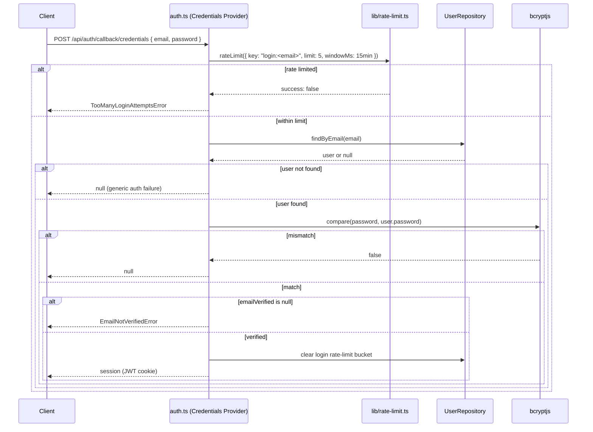

# Authentication Flow

See [03-System-Architecture.md § 6](../03-System-Architecture.md#6-authentication-flow) for full explanation.

```mermaid
sequenceDiagram
    participant Client
    participant NextAuth as auth.ts (Credentials Provider)
    participant RateLimit as lib/rate-limit.ts
    participant UserRepo as UserRepository
    participant Bcrypt as bcryptjs

    Client->>NextAuth: POST /api/auth/callback/credentials { email, password }
    NextAuth->>RateLimit: rateLimit({ key: "login:<email>", limit: 5, windowMs: 15min })
    alt rate limited
        RateLimit-->>NextAuth: success: false
        NextAuth-->>Client: TooManyLoginAttemptsError
    else within limit
        NextAuth->>UserRepo: findByEmail(email)
        UserRepo-->>NextAuth: user or null
        alt user not found
            NextAuth-->>Client: null (generic auth failure)
        else user found
            NextAuth->>Bcrypt: compare(password, user.password)
            alt mismatch
                Bcrypt-->>NextAuth: false
                NextAuth-->>Client: null
            else match
                alt emailVerified is null
                    NextAuth-->>Client: EmailNotVerifiedError
                else verified
                    NextAuth->>UserRepo: clear login rate-limit bucket
                    NextAuth-->>Client: session (JWT cookie)
                end
            end
        end
    end
```
