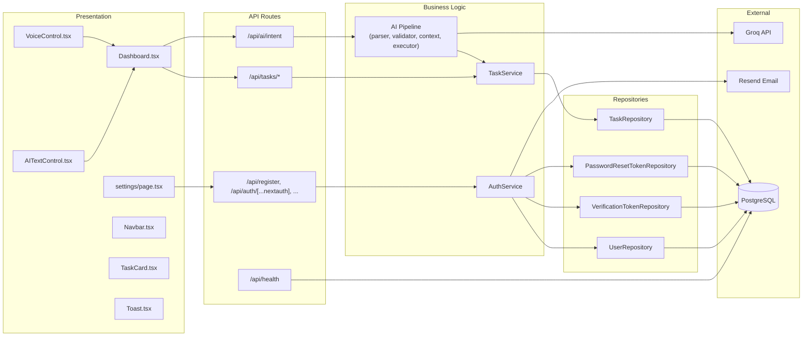

# Component Diagram

Module-level components and their direct dependencies. See [04-System-Design.md](../04-System-Design.md) for per-module detail.

```mermaid
graph LR
    subgraph Presentation
        Dashboard[Dashboard.tsx]
        Settings[settings/page.tsx]
        VoiceControl[VoiceControl.tsx]
        AITextControl[AITextControl.tsx]
        Navbar[Navbar.tsx]
        TaskCard[TaskCard.tsx]
        Toast[Toast.tsx]
    end

    subgraph API_Routes["API Routes"]
        TasksAPI["/api/tasks/*"]
        AuthAPI["/api/register, /api/auth/[...nextauth], ..."]
        AIAPI["/api/ai/intent"]
        HealthAPI["/api/health"]
    end

    subgraph Business_Logic["Business Logic"]
        TaskService
        AuthService
        AIPipeline["AI Pipeline<br/>(parser, validator, context, executor)"]
    end

    subgraph Repositories
        TaskRepo[TaskRepository]
        UserRepo[UserRepository]
        VerifyRepo[VerificationTokenRepository]
        ResetRepo[PasswordResetTokenRepository]
    end

    subgraph External
        Postgres[(PostgreSQL)]
        Groq[Groq API]
        Resend[Resend Email]
    end

    Dashboard --> TasksAPI
    Dashboard --> AIAPI
    VoiceControl --> Dashboard
    AITextControl --> Dashboard
    Settings --> AuthAPI

    TasksAPI --> TaskService
    AuthAPI --> AuthService
    AIAPI --> AIPipeline
    AIPipeline --> TaskService

    TaskService --> TaskRepo
    AuthService --> UserRepo
    AuthService --> VerifyRepo
    AuthService --> ResetRepo
    AuthService --> Resend

    TaskRepo --> Postgres
    UserRepo --> Postgres
    VerifyRepo --> Postgres
    ResetRepo --> Postgres
    HealthAPI --> Postgres
    AIPipeline --> Groq
```
