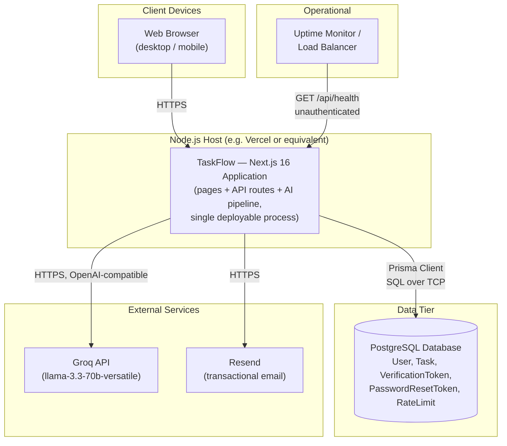

# Deployment Diagram

Reflects the deployment model described in [10-Deployment.md](../10-Deployment.md) — a single Next.js application process talking to one PostgreSQL database and two external SaaS APIs. There is no separate backend service, load balancer configuration, or container orchestration defined in the repository itself; this diagram shows the logical topology any Node.js-capable host would need to provide.

**Known gap affecting this diagram's accuracy for a *first* production deployment:** the arrow from `NextApp` to `Postgres` assumes a schema already exists in the database. As documented in [05-Database-Design.md § 7](../05-Database-Design.md#7-migration-strategy), no committed migration exists to create that schema — this must be resolved (see [10-Deployment.md § 4](../10-Deployment.md#4-database-setup)) before this deployment topology is viable against a genuinely fresh database.
