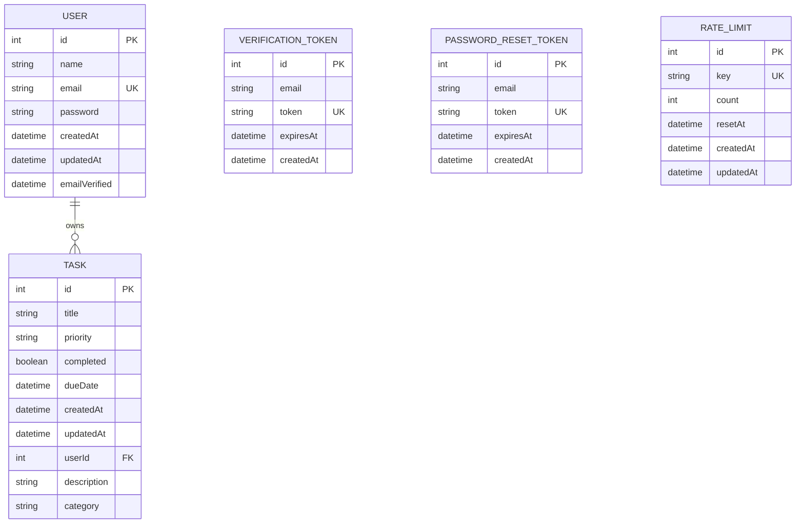

# Entity-Relationship Diagram

See [05-Database-Design.md](../05-Database-Design.md) for full schema reference, including the migration-history gap noted for this schema.

**Note:** `VERIFICATION_TOKEN`, `PASSWORD_RESET_TOKEN`, and `RATE_LIMIT` are deliberately not foreign-keyed to `USER` — they're keyed by `email`/`key` strings instead, since rate limiting in particular needs to key on things that aren't always a user ID (e.g. an IP address for unauthenticated endpoints). See [05-Database-Design.md § 5](../05-Database-Design.md#5-relationships--design-rationale).
