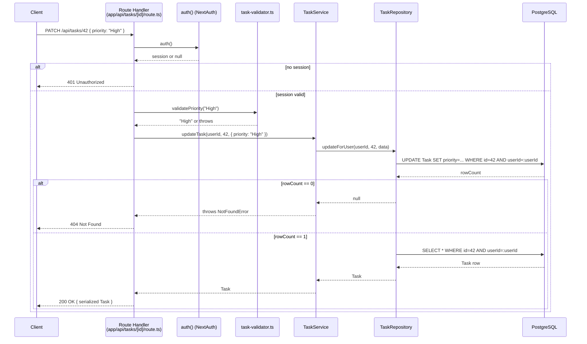

# Request Lifecycle — `PATCH /api/tasks/:id`

See [03-System-Architecture.md § 5](../03-System-Architecture.md#5-request-lifecycle) for full explanation.

```mermaid
sequenceDiagram
    participant Client
    participant Route as Route Handler<br/>(app/api/tasks/[id]/route.ts)
    participant Auth as auth() (NextAuth)
    participant Validator as task-validator.ts
    participant Service as TaskService
    participant Repo as TaskRepository
    participant DB as PostgreSQL

    Client->>Route: PATCH /api/tasks/42 { priority: "High" }
    Route->>Auth: auth()
    Auth-->>Route: session or null
    alt no session
        Route-->>Client: 401 Unauthorized
    else session valid
        Route->>Validator: validatePriority("High")
        Validator-->>Route: "High" or throws
        Route->>Service: updateTask(userId, 42, { priority: "High" })
        Service->>Repo: updateForUser(userId, 42, data)
        Repo->>DB: UPDATE Task SET priority=... WHERE id=42 AND userId=:userId
        DB-->>Repo: rowCount
        alt rowCount == 0
            Repo-->>Service: null
            Service-->>Route: throws NotFoundError
            Route-->>Client: 404 Not Found
        else rowCount == 1
            Repo->>DB: SELECT * WHERE id=42 AND userId=:userId
            DB-->>Repo: Task row
            Repo-->>Service: Task
            Service-->>Route: Task
            Route-->>Client: 200 OK { serialized Task }
        end
    end
```
