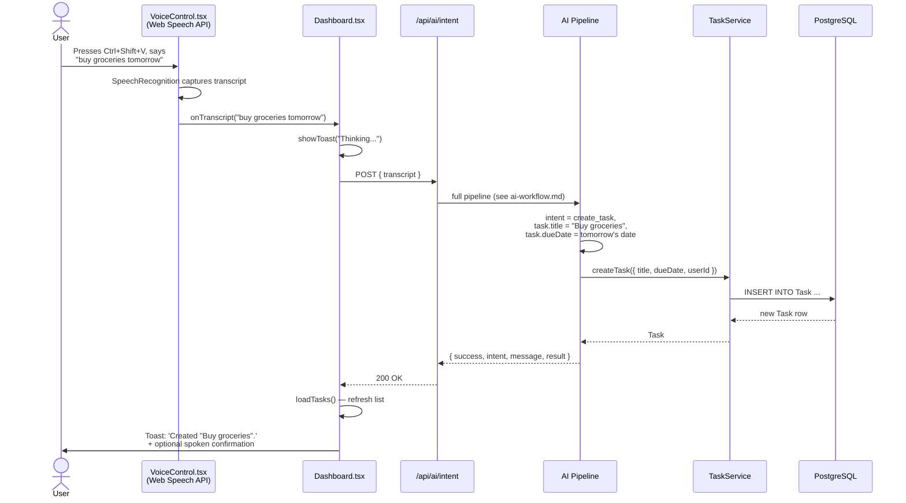

# Sequence Diagram — Creating a Task by Voice

Illustrates UC-2 from [02-Software-Requirements-Specification.md § 6](../02-Software-Requirements-Specification.md#6-use-cases).

```mermaid
sequenceDiagram
    actor User
    participant Mic as VoiceControl.tsx<br/>(Web Speech API)
    participant Dash as Dashboard.tsx
    participant Route as /api/ai/intent
    participant AI as AI Pipeline
    participant TS as TaskService
    participant DB as PostgreSQL

    User->>Mic: Presses Ctrl+Shift+V, says<br/>"buy groceries tomorrow"
    Mic->>Mic: SpeechRecognition captures transcript
    Mic->>Dash: onTranscript("buy groceries tomorrow")
    Dash->>Dash: showToast("Thinking...")
    Dash->>Route: POST { transcript }
    Route->>AI: full pipeline (see ai-workflow.md)
    AI->>AI: intent = create_task,<br/>task.title = "Buy groceries",<br/>task.dueDate = tomorrow's date
    AI->>TS: createTask({ title, dueDate, userId })
    TS->>DB: INSERT INTO Task ...
    DB-->>TS: new Task row
    TS-->>AI: Task
    AI-->>Route: { success, intent, message, result }
    Route-->>Dash: 200 OK
    Dash->>Dash: loadTasks() — refresh list
    Dash->>User: Toast: 'Created "Buy groceries".'<br/>+ optional spoken confirmation
```
