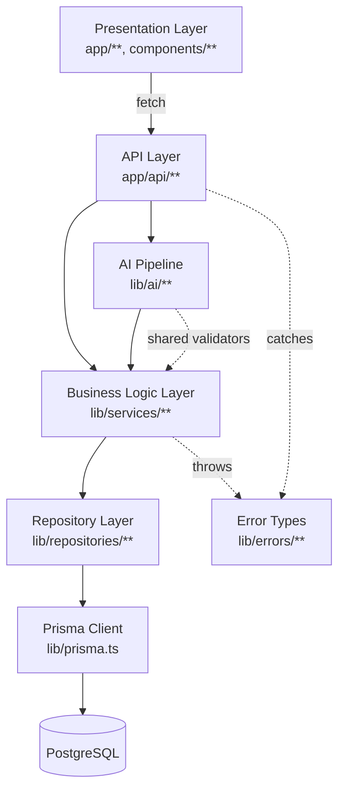

# System Architecture Diagram

See [03-System-Architecture.md](../03-System-Architecture.md) for full explanation.

**Key point:** the AI Pipeline calls into the same Business Logic Layer (`TaskService`) that the API Layer calls directly — it is a second entry point into shared logic, not a parallel implementation. See [03-System-Architecture.md § 3](../03-System-Architecture.md#3-why-this-architecture-was-chosen).
